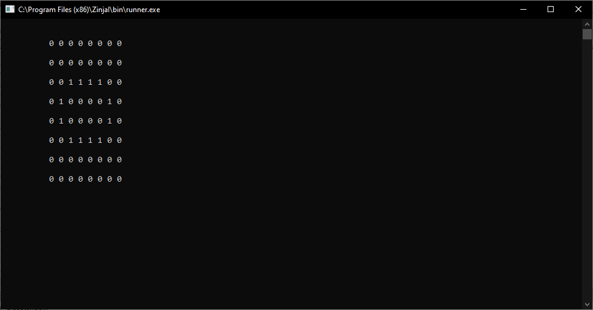

# Juego de la Vida

Este trabajo contiene una version del juego de la vida de Conway.

El codigo esta escrito en C++, las celdas vivas estan marcadas con 1 y las muertas con 0.
La configuracion inicial se hace apartir de un numero decimal y sera representado en 
cada fila de la matriz con un numero binario de 8 bits.

Este repositorio es publico y esta disponible para su edicion y optimizacion siempre y cuando
se mencione al creado: Daniel Yerena

